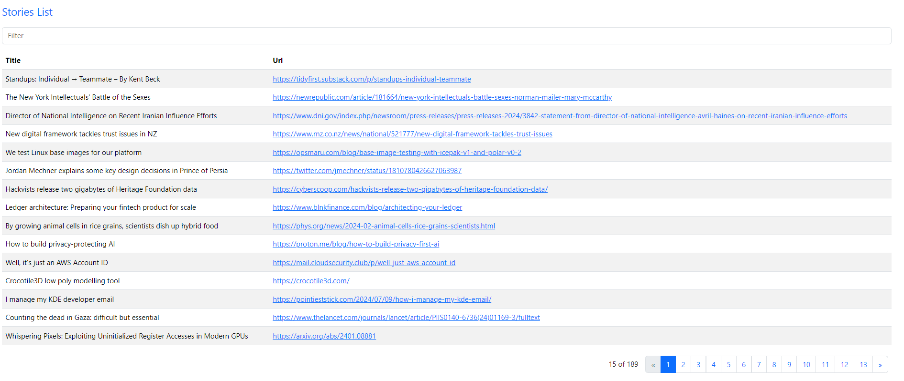

# HackerNews

Build an Angular 16 Hacker News App to consume Rest APIs, display stories.

Story Application in that:

Each Story has id, title, url.
We can navigate open a url in new tab for each story by clicking url column data.
There is a filter bar for finding stories by title and url.
There is a pagination for the table.

## Running application

Run `ng serve` for a dev server. Navigate to http://localhost:4200/. The app will automatically reload if you change any of the source files.

## Running unit tests

Run `ng test` to execute the unit tests via [Karma](https://karma-runner.github.io).

## Running end-to-end tests

Run `ng e2e` to execute the end-to-end tests via a platform of your choice. To use this command, you need to first add a package that implements end-to-end testing capabilities.

